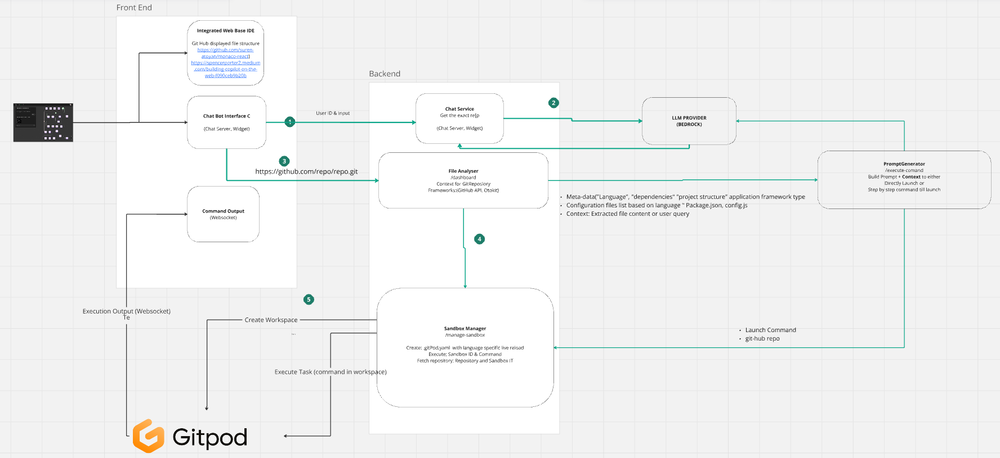

# README Documentation

## Overview

This project provides an API built with FastAPI that integrates with AWS Bedrock for language model interactions, Git repositories, and Gitpod workspace management. 

## Primary functionalities:

1. Determining required repo for user using a language Model
2. Cloning/Analysing git repo project types 
3. Generating setup commands using a language model.
4. Interacting with Gitpod to 
   * create, delete workspaces,
   * Execute command in the workspaces (tasks)
## Video and presentation of Architecture and API 
https://drive.google.com/drive/folders/1MOt_YiKbSFciMMF9h5I2UqvzuTdQ9Meq?usp=sharing


## Conceptual view


## Requirements

- Python 3.8+
- FastAPI
- boto3
- requests
- pydantic
- gitpython
- dotenv
- langchain_aws
- langchain-aws
- pydantic
- langchain
- gitpython
- json5
    

## Setup

### Install Dependencies

```sh
pip install fastapi boto3 requests pydantic gitpython python-dotenv langchain_aws uvicorn
```

### Environment Variables

Create a `.env` file in the root directory and add the following environment variables:

```
AWS_PROFILE=name_of_your_aws_profile
API_TOKEN=your_gitpod_api_token
```

### Running the Application

To run the application, use the following command:

```sh
uvicorn main:app --host 0.0.0.0 --port 8000
```

## API Endpoints

### Clone Repository and Generate Setup Commands

### Base url for alle  pont 

https://18.237.155.139:8002

e.g https://18.237.155.139:8002/dashboard

**Endpoint**: `/dashboard`

**Method**: `POST`

**Request Body**:

```json
{
  "git_url": "https://github.com/giventech/rwd.git"
}

```

**Response**:

```json
{
  "user_input": "https://github.com/giventech/rwd.git",
  "command": "bundle install && rails new project_name -d postgresql && cd project_name && rails server",
  "typeFound": true,
  "model_output": {
    "content": "bundle install && rails new project_name -d postgresql && cd project_name && rails server",
    "additional_kwargs": {
      "usage": {
        "prompt_tokens": 149,
        "completion_tokens": 22,
        "total_tokens": 171
      },
      "stop_reason": "end_turn",
      "model_id": "anthropic.claude-3-haiku-20240307-v1:0"
    },
    "response_metadata": {
      "usage": {
        "prompt_tokens": 149,
        "completion_tokens": 22,
        "total_tokens": 171
      },
      "stop_reason": "end_turn",
      "model_id": "anthropic.claude-3-haiku-20240307-v1:0"
    },
    "type": "ai",
    "name": null,
    "id": "run-155a47bf-f10d-4ca6-9fb3-e6ed1a138cca-0",
    "example": false,
    "tool_calls": [],
    "invalid_tool_calls": [],
    "usage_metadata": {
      "input_tokens": 149,
      "output_tokens": 22,
      "total_tokens": 171
    }
  }
}
```

### Chat LLM : Succession of question to find what is the repo

**Endpoint**: `/chat-llm/`

**Method**: `POST`

**Request Body 1**:
userId and requestId must be unique for each requests
```json
{
  "userID": "user124",
  "requestID": "req124",
  "user_input": "I want a node base application for a note book",
  "modelID": "anthropic.claude-3-haiku-20240307-v1:0",
  "modelParameter": {
    "temperature": 0.75,
    "max_tokens": 2000,
    "top_p": 0.9
  }
}
```

**Response 1**:

```json
{
  "user_input": "I want a node base application for a note book",
  "model_output": "<ol>\n  <li>\n    <a href=\"https://github.com/microsoft/vscode-notebook-renderer\">https://github.com/microsoft/vscode-notebook-renderer</a>\n    <p>This repo provides a framework for creating notebook renderers in Visual Studio Code, allowing you to build custom notebook experiences.</p>\n  </li>\n  <li>\n    <a href=\"https://github.com/jupyter/notebook\">https://github.com/jupyter/notebook</a>\n    <p>This is the classic Jupyter Notebook application, a web-based interactive computing environment that allows users to create and share documents that contain live code, visualizations, and narrative text.</p>\n  </li>\n  <li>\n    <a href=\"https://github.com/nteract/nteract\">https://github.com/nteract/nteract</a>\n    <p>nteract is a desktop application that provides an enhanced Jupyter Notebook experience, with support for multiple kernels, interactive plotting, and more.</p>\n  </li>\n  <li>\n    <a href=\"https://github.com/JupyterLab/jupyterlab\">https://github.com/JupyterLab/jupyterlab</a>\n    <p>JupyterLab is the next-generation web-based user interface for Project Jupyter, providing a more powerful and flexible environment for working with notebooks, data, and applications.</p>\n  </li>\n</ol>\n\n<p>Which option do you prefer?</p>",
  "wantsToDraw": false,
  "repository": null
}
```

**Request Body 2**:
userId and requestId must be unique for each requests

```json
{
"userID": "user123",
"requestID": "req123",
"user_input": "1",
"modelID": "anthropic.claude-3-haiku-20240307-v1:0",
"modelParameter": {
"temperature": 0.75,
"max_tokens": 2000,
"top_p": 0.9
}
}
```


**Response 2 ( Use choose solution 1)**:
```json
{
  "user_input": "1",
  "model_output": "Based on your preference for option 1, I would recommend the following repository:\n\nhttps://github.com/microsoft/vscode-notebook-renderer.git\n\nThis repository provides a framework for creating notebook renderers in Visual Studio Code, allowing you to build custom notebook experiences.",
  "wantsToDraw": false,
  "repository": "https://github.com/microsoft/vscode-notebook-renderer.git"
}
```


### List Organizations

**Endpoint**: `/organizations/`

**Method**: `GET`

**Response**:

```json
{
  "organizations": [...]
}
```

### List Workspaces

**Endpoint**: `/workspaces/`

**Method**: `GET`

**Query Parameter**:

- `organizationId` (required)

**Response**:

```json
{
  "workspaces": [...]
}
```

### Start Workspace

**Endpoint**: `/start-workspace/`

**Method**: `POST`

**Query Parameter**:

- `workspaceId` (required)

**Response**:

```json
{
  "status": "Workspace started"
}
```

### Stop Workspace

**Endpoint**: `/stop-workspace/`

**Method**: `POST`

**Query Parameter**:

- `workspaceId` (required)

**Response**:

```json
{
  "status": "Workspace stopped"
}
```

### Create Workspace && Execute command in workspace environment

* When creating a workspace a set of tasks can be run along with it. 
* Tasks can be seen as system commands. 
* We can therefore pass commands to run in a workspace/sandox environment

**Endpoint**: `/create-workspace/`

**Method**: `POST`

**Query Parameters**:

- `ownerId` (required)
- `organizationId` (required)

**Request Body**:

```json
{
  "contextUrl": {
    "url": "https://github.com/giventech/rwd.git",
    "workspaceClass": "g1-standard",
    "config": {
      "tasks": [
        {
          "name": "Setup and Install",
          "openMode": "default",
          "command": "bundle install && rails new project_name -d postgresql && cd project_name && rails server"
        }
      ]
    },
    "editor": {
      "name": "code",
      "version": "latest"
    }
  },
  "metadata": {
    "ownerId": "owner123",
    "organizationId": "org123"
  }
}
```

**Response**:

```json
{
  "workspaceId": "new_workspace_id",
  "status": "Workspace created and started"
}
```

### Delete Workspace

**Endpoint**: `/delete-workspace/`

**Method**: `DELETE`

**Query Parameter**:

- `workspaceId` (required)

**Response**:

```json
{
  "status": "Workspace deleted"
}
```

## Additional Information

- Ensure the AWS credentials are properly configured for the `AWS_PROFILE` specified.
- The API_TOKEN should be a valid token for Gitpod API access.

This documentation provides an overview of the available endpoints and their usage. For more detailed information, refer to the source code and the corresponding comments.
